<!-- DOCTOR DOOM CYBER-FORTRESS PROFILE HEADER -->

  

<!-- SIDE-BY-SIDE FLOATING CONTAINER -->

  <!-- STATS CARDS FLOATED RIGHT -->
  
  

  <!-- RETRO CYBER-CONSOLE METADATA BLOCK -->
  <pre><code>╔══════════════════════════════════════════════════════════╗
║ [!] LATVERIAN SYSTEM SECURITY TELEMETRY                  ║
╠══════════════════════════════════════════════════════════╣
║ [+] IDENTITY   : Ranilo John (Shizuphrenia)              ║
║ [*] STATUS     : ACTIVE THREAT DEFENSE MATRIX            ║
║ [^] CLEARANCE  : MAXIMUM HIGH RULER LEVEL                ║
║ [>] DIRECTIVE  : "Establish order over network chaos."   ║
╠══════════════════════════════════════════════════════════╣
║ [ SYSTEMS OPERATIONS TELEMETRY ]                         ║
║  ├── Cybersecurity : Wazuh SIEM, Suricata IDS, SOC       ║
║  ├── Networking    : Cisco CCNA, VLANs, OSPF, STP        ║
║  ├── Dev Engines   : Python, Java, HTML, CSS, Shell      ║
║  └── Platforms     : Hardened Linux, VMWare, GNS3        ║
╠══════════════════════════════════════════════════════════╣
║ [!] DECREE: "None shall rival the fortress of Doom."     ║
╚══════════════════════════════════════════════════════════╝</code></pre>

 

---

## ⚡ Arsenal Systems

  <!-- Cybersecurity -->
  
  
  
  
  
   
  
  <!-- Networking -->
  
  
  
  
   
  
  <!-- Programming / Systems -->
  
  
  
  

---

## 📊 Latverian Grid Contributions

  

---

## 📊 Latverian Language Diagnostics

  

---

## 🎵 Live Audio Comm Transmission (Spotify)

  

