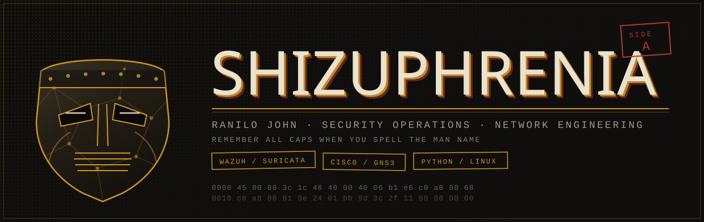

  

<table>
<tr>
<td width="52%" valign="top">

<pre>
        LINER NOTES / SIDE A
  ----------------------------------------
  ARTIST     Ranilo John
  ALIAS      Shizuphrenia
  BILLING    Security analyst, network eng.
  PRESSED IN Hardened Linux, VMware, GNS3
  ----------------------------------------
  "The villain gets the mask. The analyst
   gets the packet capture. Same job:
   watch everybody, say nothing, and know
   the network better than it knows itself."
  ----------------------------------------
  ENGINEERED Wazuh . Suricata . Wireshark
  MIXED ON   Cisco IOS . OSPF . VLAN . STP
  WRITTEN IN Python . Java . Bash
  ----------------------------------------
  RUN OUT GROOVE:  ALL CAPS, NO EXCEPTIONS
</pre>

</td>
<td width="48%" valign="top">

</td>
</tr>
</table>

---

## TRACKLIST

Everything below is a thing I actually do, not a badge I found. No runtimes, no invented percentages.

**SIDE A — DEFENSE**

| # | TRACK | PRODUCED WITH |
|---|-------|---------------|
| A1 | Threat detection & alert triage | Wazuh, Suricata |
| A2 | SOC operations and incident write-up | Alert pipelines, IR notes |
| A3 | Behavioural anomaly hunting | Log correlation, baselining |
| A4 | Vulnerability assessment | Scanning, remediation tracking |

**SIDE B — THE NETWORK**

| # | TRACK | PRODUCED WITH |
|---|-------|---------------|
| B1 | Routing & switching | Cisco IOS, VLANs, VTP, OSPF |
| B2 | Subnetting & loop prevention | IP planning, STP |
| B3 | Packet analysis | Wireshark, deep packet inspection |
| B4 | Lab topologies | GNS3, VMware Workstation |

**SIDE C — THE CODE**

| # | TRACK | PRODUCED WITH |
|---|-------|---------------|
| C1 | Security tooling & automation | Python |
| C2 | Systems logic | Java |
| C3 | Host administration | Ubuntu, Kali, shell |
| C4 | Interfaces & drafting | HTML, CSS, AutoCAD 3D |

---

## THE CRATE

  

---

## NOW SPINNING

  

  Full console — SOC simulator, live topology, the whole sleeve — at <a href="https://ranilojohn.github.io/Shizuphrenia/">ranilojohn.github.io/Shizuphrenia</a>

